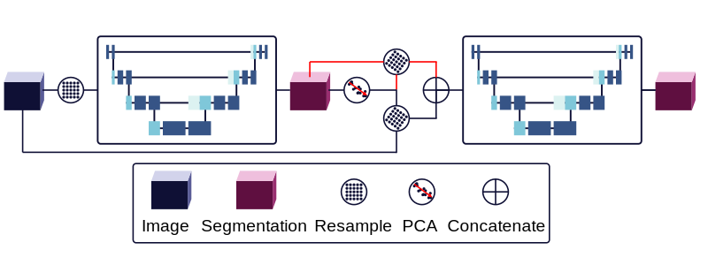

# AAANet

`AAANet` is a segmentation network for abdominal aortic aneurysm (AAA) described in the article, "Abdominal Aortic Aneurysm (AAA) Segmentation from Sub-Millimeter Computed Tomography Angiography (CTA)," submitted to Medical Imaging with Deep Learning (MIDL) 2024.



## Network Weights

Trained network weights are available here:

https://github.com/sudomakeinstall/2024-midl-aaa/releases

## Basic Usage

```
./aaa-net-runner.py ./experiment.toml --train
./aaa-net-runner.py ./experiment.toml --load-checkpoint=last --test
```

## Documentation and Testing

Build and serve the documentation:

```
mkdocs serve
```

Run the tests:

```
python -m doctest ./dv/geometry.py
```

## Citation

